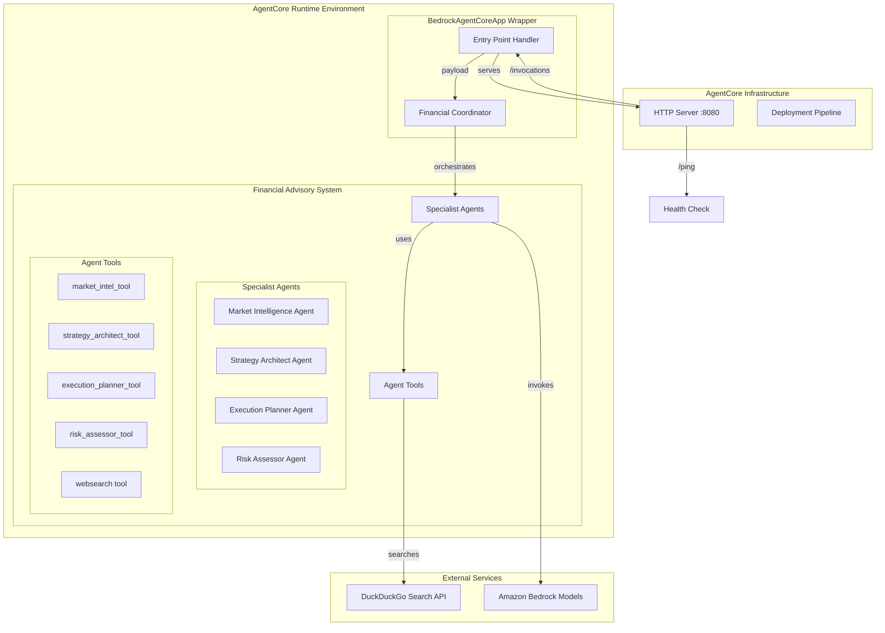

# Design Document

## Overview

This design document outlines the transformation of the existing financial advisor multiagent system (`financial_advisor_multiagent.py`) to be compatible with Amazon Bedrock AgentCore Runtime. The transformation will maintain all existing functionality while adapting to AgentCore's runtime service contract and deployment patterns.

The design follows the **SDK Integration approach** (Option A) from AgentCore documentation, which provides automatic HTTP server setup and built-in deployment tools while requiring minimal changes to the existing agent logic.

## Architecture

### High-Level Architecture



### Component Transformation Strategy

The transformation will wrap the existing `FinancialAdvisorOrchestrator` within the AgentCore runtime pattern while preserving all internal logic:

1. **Minimal Code Changes**: Preserve existing agent logic and orchestration patterns
2. **Runtime Wrapper**: Use `BedrockAgentCoreApp` to handle HTTP service contract
3. **Payload Adaptation**: Transform AgentCore payloads to existing system inputs
4. **Response Formatting**: Convert system outputs to AgentCore-compatible responses

## Components and Interfaces

### 1. AgentCore Entry Point

**Purpose**: Serve as the main entry point for AgentCore Runtime, handling HTTP requests and payload transformation.

**Implementation**:
```python
from bedrock_agentcore.runtime import BedrockAgentCoreApp
from financial_advisor_multiagent import FinancialAdvisorOrchestrator

app = BedrockAgentCoreApp()
advisor = FinancialAdvisorOrchestrator()

@app.entrypoint
def invoke(payload):
    """
    AgentCore entry point that processes financial advisory requests.
    
    Args:
        payload (dict): AgentCore payload with 'prompt' field
        
    Returns:
        dict: Structured response with 'result' field
    """
    # Extract user query from payload
    user_query = payload.get("prompt", "")
    
    # Process through existing orchestrator
    response = advisor.analyze(user_query)
    
    # Return AgentCore-compatible response
    return {"result": response}

if __name__ == "__main__":
    app.run()
```

**Interface Contract**:
- **Input**: JSON payload with `prompt` field containing user query
- **Output**: JSON response with `result` field containing financial analysis
- **HTTP Endpoints**: 
  - `POST /invocations` - Main agent invocation
  - `GET /ping` - Health check (handled by BedrockAgentCoreApp)

### 2. Preserved Financial Advisory System

**Purpose**: Maintain all existing financial advisory capabilities without modification.

**Components Preserved**:
- `FinancialAdvisorOrchestrator` class with all methods
- `FinancialAdvisoryAgents` container class
- All specialist agents (market intelligence, strategy architect, execution planner, risk assessor)
- Agent tools (`market_intel_tool`, `strategy_architect_tool`, etc.)
- Token management and error handling mechanisms
- Web search integration with DuckDuckGo

**Key Preservation Points**:
- 2000-token conservative limits maintained
- Multi-parameter format attempts for model compatibility
- Educational disclaimers in all outputs
- Robust error handling and fallback mechanisms

### 3. Payload Processing Layer

**Purpose**: Transform between AgentCore payload format and existing system inputs.

**Input Processing**:
```python
def process_agentcore_payload(payload):
    """
    Extract and validate user query from AgentCore payload.
    
    Args:
        payload (dict): AgentCore request payload
        
    Returns:
        str: Processed user query for financial advisor system
    """
    user_query = payload.get("prompt", "")
    
    if not user_query:
        return "Please provide a financial advisory request. Include ticker symbol, risk tolerance (Conservative/Moderate/Aggressive), and investment horizon (Short-term/Medium-term/Long-term) for best results."
    
    return user_query
```

**Response Processing**:
```python
def format_agentcore_response(advisor_response):
    """
    Format financial advisor response for AgentCore compatibility.
    
    Args:
        advisor_response (str): Response from FinancialAdvisorOrchestrator
        
    Returns:
        dict: AgentCore-compatible response structure
    """
    return {
        "result": advisor_response,
        "timestamp": datetime.now(timezone.utc).isoformat(),
        "system": "financial-advisor-multiagent"
    }
```

### 4. Dependency Management

**Purpose**: Ensure all required dependencies are available in the AgentCore runtime environment.

**Requirements File Structure**:
```text
# Core AgentCore dependencies
bedrock-agentcore>=1.0.0

# Existing system dependencies (preserved)
strands-agents>=1.10.0
strands-agents-tools>=0.2.9
duckduckgo-search>=6.3.4

# Supporting dependencies
boto3>=1.40.0
pydantic>=2.11.0
```

**Dependency Validation**:
- Verify compatibility between AgentCore SDK and Strands Agents
- Ensure DuckDuckGo search functionality works in containerized environment
- Validate model access through Bedrock in AgentCore runtime

## Data Models

### Input Data Model

```python
from pydantic import BaseModel
from typing import Optional, Dict, Any

class AgentCorePayload(BaseModel):
    """AgentCore request payload structure"""
    prompt: str
    metadata: Optional[Dict[str, Any]] = None
    session_id: Optional[str] = None
```

### Output Data Model

```python
class AgentCoreResponse(BaseModel):
    """AgentCore response structure"""
    result: str
    timestamp: str
    system: str = "financial-advisor-multiagent"
    metadata: Optional[Dict[str, Any]] = None
```

### Internal Data Models (Preserved)

All existing data structures from the original system are preserved:
- Agent invocation parameters
- Tool response formats
- Error handling structures
- Token management configurations

## Error Handling

### AgentCore-Specific Error Handling

**HTTP Error Responses**:
```python
@app.entrypoint
def invoke(payload):
    try:
        # Process request
        user_query = process_agentcore_payload(payload)
        response = advisor.analyze(user_query)
        return format_agentcore_response(response)
        
    except ValueError as e:
        # Invalid payload format
        return {"error": f"Invalid request format: {str(e)}"}
        
    except Exception as e:
        # General system errors
        app.logger.error(f"Financial advisor error: {e}")
        return {"error": "An error occurred processing your financial advisory request"}
```

**Preserved Error Handling**:
- All existing agent invocation error handling maintained
- Web search rate limiting and API error handling preserved
- Token limit and truncation error handling maintained
- Model provider fallback mechanisms preserved

### Error Categories

1. **Payload Errors**: Invalid or missing prompt field
2. **Agent Errors**: Specialist agent invocation failures
3. **External Service Errors**: DuckDuckGo API failures, rate limits
4. **Model Errors**: Bedrock model access or response issues
5. **System Errors**: General application failures

## Testing Strategy

### Local Testing Approach

**Development Testing**:
```bash
# Start local AgentCore server
python financial_advisor_agentcore.py

# Test basic functionality
curl -X POST http://localhost:8080/invocations \
  -H "Content-Type: application/json" \
  -d '{"prompt": "Analyze AAPL stock for moderate risk investor"}'

# Test health endpoint
curl http://localhost:8080/ping
```

**Integration Testing**:
- Verify all specialist agents function correctly
- Test web search integration in containerized environment
- Validate token limits and truncation behavior
- Confirm educational disclaimers in all responses

### AgentCore Deployment Testing

**CLI Testing**:
```bash
# Configure for deployment
agentcore configure --entrypoint financial_advisor_agentcore.py

# Deploy to AWS
agentcore launch

# Test deployed agent
agentcore invoke '{"prompt": "Provide financial analysis for TSLA with aggressive risk tolerance"}'
```

**Automated Testing**:
- Unit tests for payload processing functions
- Integration tests for complete analysis workflows
- Error handling tests for various failure scenarios
- Performance tests for token limit compliance

### Test Cases

1. **Basic Functionality**:
   - Simple stock analysis requests
   - Complete workflow execution (market → strategy → execution → risk)
   - Educational disclaimer inclusion

2. **Parameter Extraction**:
   - Ticker symbol identification
   - Risk tolerance parsing
   - Investment horizon detection
   - Missing parameter handling

3. **Error Scenarios**:
   - Invalid payload formats
   - Web search API failures
   - Model invocation errors
   - Token limit exceeded scenarios

4. **Edge Cases**:
   - Empty prompt handling
   - Very long user queries
   - Special characters in ticker symbols
   - Concurrent request handling

## Deployment Architecture

### File Structure

```
agentcore-financial-advisor/
├── financial_advisor_agentcore.py    # AgentCore entry point
├── financial_advisor_multiagent.py   # Existing system (imported)
├── requirements.txt                  # All dependencies
├── README.md                        # Deployment instructions
└── tests/                           # Test suite
    ├── test_agentcore_integration.py
    ├── test_payload_processing.py
    └── test_error_handling.py
```

### Deployment Process

1. **Preparation**:
   - Create AgentCore wrapper file
   - Update requirements.txt with AgentCore dependencies
   - Validate local testing

2. **Configuration**:
   - Use AgentCore CLI to configure deployment
   - Specify entry point as the new wrapper file
   - Set up AWS credentials and permissions

3. **Deployment**:
   - Deploy using `agentcore launch`
   - Verify deployment status
   - Test with sample requests

4. **Monitoring**:
   - Enable CloudWatch observability
   - Set up error monitoring
   - Configure performance metrics

### Infrastructure Requirements

- **AWS Account**: With appropriate AgentCore permissions
- **Python Environment**: 3.10+ with virtual environment
- **Dependencies**: All existing plus AgentCore SDK
- **Network**: Public network mode for external API access (DuckDuckGo)
- **Compute**: ARM64 container runtime in AgentCore

## Security Considerations

### Data Protection
- No sensitive financial data stored or logged
- Educational disclaimers prevent misuse as actual financial advice
- Session isolation provided by AgentCore Runtime

### API Security
- DuckDuckGo search API calls use public endpoints
- Bedrock model access through IAM roles
- No API keys or credentials stored in code

### Access Control
- AgentCore Runtime handles authentication and authorization
- IAM roles control Bedrock model access
- Network isolation through AgentCore infrastructure

## Performance Considerations

### Token Management
- Maintain 2000-token conservative limits
- Preserve existing truncation strategies
- Monitor token usage in AgentCore environment

### Response Times
- Web search may introduce latency
- Multiple agent invocations in sequence
- Consider timeout handling for long-running analyses

### Scalability
- AgentCore Runtime handles scaling automatically
- Stateless agent design supports horizontal scaling
- Session isolation prevents interference between users

## Migration Strategy

### Phase 1: Wrapper Creation
- Create AgentCore entry point wrapper
- Implement payload processing functions
- Add error handling for AgentCore context

### Phase 2: Local Testing
- Test complete functionality locally
- Validate all specialist agents work correctly
- Verify web search integration

### Phase 3: Deployment Preparation
- Create requirements.txt with all dependencies
- Set up AWS credentials and permissions
- Configure AgentCore CLI

### Phase 4: Production Deployment
- Deploy to AgentCore Runtime
- Conduct end-to-end testing
- Enable monitoring and observability

### Phase 5: Validation
- Compare outputs with original system
- Verify educational disclaimers maintained
- Confirm error handling works correctly