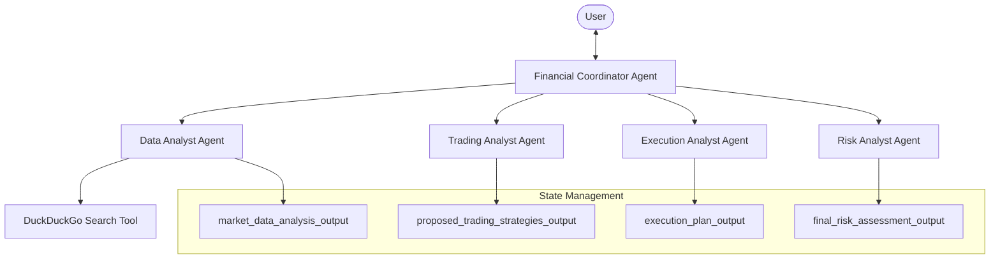

# Design Document

## Overview

The Financial Advisor Multiagent System implements a sophisticated "Agents as Tools" pattern using the Strands Agents SDK. The system consists of a primary orchestrator agent that coordinates four specialized sub-agents to provide comprehensive financial advisory services. This design follows the hierarchical delegation pattern where a financial coordinator manages specialized agents for data analysis, trading strategy development, execution planning, and risk assessment.

The system is designed as an educational tool that guides users through a structured financial advisory process while maintaining clear disclaimers about the educational nature of the advice provided.

## Architecture

### High-Level Architecture



### Agent Hierarchy

1. **Financial Coordinator Agent** (Primary Orchestrator)
   - Manages user interaction and workflow orchestration
   - Routes requests to appropriate specialized agents
   - Maintains conversation state and context
   - Provides introductions and disclaimers

2. **Data Analyst Agent** (Specialized Tool Agent)
   - Performs market research using DuckDuckGo Search
   - Generates comprehensive market analysis reports
   - Focuses on SEC filings, news, and analyst commentary

3. **Trading Analyst Agent** (Specialized Tool Agent)
   - Develops tailored trading strategies
   - Aligns strategies with user risk profile and timeline
   - Provides detailed strategy analysis and rationale

4. **Execution Analyst Agent** (Specialized Tool Agent)
   - Creates detailed execution plans
   - Defines order types, position sizing, and risk management
   - Provides tactical implementation guidance

5. **Risk Analyst Agent** (Specialized Tool Agent)
   - Evaluates overall risk profile
   - Assesses alignment with user preferences
   - Provides comprehensive risk analysis and recommendations

## Components and Interfaces

### Agent Configuration

#### Financial Coordinator Agent
```python
financial_coordinator = LlmAgent(
    name="financial_coordinator",
    model=MODEL,
    description="Guide users through structured financial advisory process",
    instruction=FINANCIAL_COORDINATOR_PROMPT,
    output_key="financial_coordinator_output",
    tools=[
        AgentTool(agent=data_analyst_agent),
        AgentTool(agent=trading_analyst_agent),
        AgentTool(agent=execution_analyst_agent),
        AgentTool(agent=risk_analyst_agent),
    ]
)
```

#### Specialized Agents
Each specialized agent follows this pattern:
```python
agent = LlmAgent(
    model=MODEL,
    name="agent_name",
    description="Agent description",
    instruction="Detailed prompt with role and responsibilities",
    output_key="unique_output_key",
    tools=[relevant_tools]  # Only data_analyst has Google Search
)
```

### State Management

The system uses output keys to maintain state between agent interactions:

- `market_data_analysis_output`: Market research and analysis data
- `proposed_trading_strategies_output`: Generated trading strategies
- `execution_plan_output`: Detailed execution plans
- `final_risk_assessment_output`: Comprehensive risk analysis

### Tool Integration

#### DuckDuckGo Search Tool
- Used exclusively by the Data Analyst Agent
- Performs market research and data gathering
- Targets recent information (configurable timeframe)
- Gathers multiple sources for comprehensive analysis

#### AgentTool Wrapper
- Wraps specialized agents as callable tools
- Enables the coordinator to invoke sub-agents
- Maintains proper state passing between agents

## Data Models

### User Input Model
```python
class UserPreferences:
    risk_attitude: str  # "Conservative", "Moderate", "Aggressive"
    investment_period: str  # "Short-term", "Medium-term", "Long-term"
    ticker_symbol: str  # Stock ticker to analyze
    execution_preferences: Optional[str]  # Broker/order preferences
```

### Market Analysis Output
```python
class MarketAnalysisReport:
    ticker: str
    report_date: str
    information_freshness_days: int
    sources_count: int
    executive_summary: List[str]
    sec_filings: str
    news_and_sentiment: str
    analyst_commentary: str
    risks_and_opportunities: Dict[str, List[str]]
    reference_articles: List[Dict[str, str]]
```

### Trading Strategy Output
```python
class TradingStrategy:
    name: str
    description: str
    rationale: str
    risk_alignment: str
    key_indicators: List[str]
    entry_conditions: str
    exit_conditions: str
    specific_risks: List[str]
```

### Execution Plan Output
```python
class ExecutionPlan:
    foundational_philosophy: str
    entry_strategy: str
    holding_management: str
    accumulation_strategy: str
    profit_taking_strategy: str
    full_exit_strategy: str
```

### Risk Assessment Output
```python
class RiskAssessment:
    executive_summary: str
    market_risks: List[str]
    liquidity_risks: List[str]
    counterparty_risks: List[str]
    operational_risks: List[str]
    strategy_risks: List[str]
    psychological_risks: List[str]
    alignment_assessment: str
    recommendations: List[str]
```

## Error Handling

### Agent-Level Error Handling
- Each specialized agent includes try-catch blocks
- Graceful degradation when tools fail
- Clear error messages returned to coordinator
- Fallback strategies for critical failures

### Coordinator Error Handling
- Validates user inputs before agent invocation
- Handles agent communication failures
- Provides user-friendly error messages
- Maintains conversation state during errors

### Tool Error Handling
- DuckDuckGo Search tool failures handled gracefully
- Network connectivity issues managed
- Rate limiting and API quota management
- Alternative data sources when primary fails

## Testing Strategy

### Unit Testing
- Individual agent prompt validation
- Tool integration testing
- State management verification
- Error handling validation

### Integration Testing
- End-to-end workflow testing
- Agent communication testing
- State passing between agents
- Tool invocation and response handling

### User Acceptance Testing
- Complete user journey testing
- Different user preference combinations
- Edge case scenario testing
- Disclaimer and educational content validation

### Performance Testing
- Response time measurement
- Concurrent user handling
- Resource utilization monitoring
- Scalability assessment

## Security and Compliance

### Educational Disclaimers
- Prominent disclaimer display at system start
- Repeated disclaimers in agent outputs
- Clear educational purpose statements
- No financial advice claims

### Data Privacy
- No persistent storage of user financial data
- Session-based state management only
- Secure handling of API keys and credentials
- Compliance with data protection regulations

### Content Filtering
- Inappropriate content detection
- Financial advice claim prevention
- Regulatory compliance checking
- Risk disclosure requirements

## Deployment Considerations

### Environment Setup
- Python environment with Strands Agents SDK
- DuckDuckGo Search integration (no API key required)
- Model provider configuration (Bedrock, OpenAI, etc.)
- Environment variable management

### Scalability
- Stateless agent design for horizontal scaling
- Efficient resource utilization
- Caching strategies for repeated queries
- Load balancing considerations

### Monitoring and Observability
- Agent performance metrics
- User interaction tracking
- Error rate monitoring
- Tool usage analytics

### Configuration Management
- Flexible model provider selection
- Configurable search parameters
- Adjustable disclaimer content
- Environment-specific settings