# From Idea to Production: Building Multi-Agent Financial Advisors with Kiro & Strands

## 🎯 **Top 10 Story Points for 15-Minute Demo**

### 1. **The Challenge: Traditional Development vs. AI-First Approach**
- Traditional: Weeks of boilerplate, complex integrations, deployment headaches
- **Kiro Solution**: Natural language → Working code → Production deployment

### 2. **The Kiro Advantage: MCP Server Foundation**
- Model Context Protocol (MCP) as the backbone
- Seamless tool integration and context management
- One prompt → Complete working solution

### 3. **Journey Stage 1: Simple Strands Agent Creation Manual**
- **Demo**: "Create a basic working Strands Solution"

### 4. **Journey Stage 2: Multi-Agent Architecture Evolution**
- **Demo**: "Convert this to a multi-agent system with specialist roles"
- Market Intelligence → Strategy → Execution → Risk Assessment
- Automatic orchestration patterns

### 5. **Journey Stage 3: Production-Ready Features**
- **Demo**: Error handling, token management, security practices
- Educational disclaimers and responsible AI implementation
- All generated through natural language prompts

### 6. **Journey Stage 4: Bedrock AgentCore Deployment**
- **Demo**: "Convert this Strands code for Bedrock AgentCore deployment"
- Single prompt transforms local code to cloud-ready
- AWS-native integration patterns

### 7. **The Power of Hooks & Streaming**
- Real-time response streaming
- Custom hooks for specialized workflows
- Enhanced user experience patterns

### 8. **Spec-Driven Development**
- Automatic API specification generation
- Documentation that stays in sync
- Contract-first development approach

### 9. **Best Practices by Default**
- Security patterns automatically implemented
- Scalability considerations built-in
- Monitoring and observability included

### 10. **The Future: AI-First Development Paradigm**
- From months to minutes
- From expert-only to accessible
- From fragile to production-ready

---

## 🚀 **The Complete Journey: From Concept to Cloud**

### **Stage 1: Foundation with MCP Server**
```
💡 Idea → 🤖 Kiro →  Add MCP → 📝 Natural Language Prompt → ⚡ Working Code
```

**Key Message**: "I started with just an idea and a simple prompt to Kiro"

---

### **Stage 2: Strands Agent Creation ipynb Notebook**
```
🎯 Basic Prompt → 🔧 Strands Framework → 🤖 Financial Advisor Agent → ✅ Working Solution
```

Build a 4-step multi-agent Financial Advisor using Strands.

Coordinator guides user through:
1) Market Analysis → 2) Trading Strategies → 3) Execution Plan → 4) Risk Review.

Each step uses a subagent:
- data_analyst_agent: gathers news + SEC data for provided_ticker.
- trading_analyst_agent: builds 5+ strategies based on risk & time horizon.
- execution_analyst_agent: turns strategies into an execution plan.
- risk_analyst_agent: reviews total risk & profile alignment.

Show this intro:
“Hello! I’ll guide you through financial analysis, strategy, execution, and risk. Say 'show me markdown' anytime. Ready to start?”

Show this disclaimer (and append to every agent's output):
“This is educational only, not financial advice. Past performance ≠ future results. Consult a qualified advisor.”

Use shared state: provided_ticker, user_risk_attitude, user_investment_period, outputs from each step.

Coordinator runs agents in order, passes state, summarizes outputs.

```

**Demo Prompt**: *"Create a financial advisor agent using Strands that can analyze stocks"*

**What Kiro Generated**:
- Complete agent structure
- Tool integrations
- Error handling
- Best practices

---

### **Stage 3: Multi-Agent Evolution**
```
🔄 Single Agent → 🏗️ Architecture Prompt → 👥 Multi-Agent System → 🎯 Specialist Roles
```

**Demo Prompt**: *"Convert this to a multi-agent system with market research, strategy, execution, and risk assessment specialists"*

**What Kiro Delivered**:
- 4 specialized agents
- Orchestration patterns
- Inter-agent communication
- Workflow management

---

### **Stage 4: Production Enhancement**
```
🛠️ Basic Code → 🔒 Production Prompt → 🚀 Enterprise-Ready → ✨ Best Practices
```

**Demo Prompt**: *"Make this production-ready using Bedrock agentcore for the python financial_advisor.py  with security, monitoring, and responsible AI practices"*

**Kiro's Additions**:
- Input validation
- Token management
- Educational disclaimers
- Error handling
- Logging integration

---

### **Stage 5: Cloud Deployment**
```
💻 Local Code → ☁️ Bedrock Prompt → 🏗️ AgentCore Ready → 🚀 AWS Deployment
```

**Demo Prompt**: *"Convert this Strands code for Amazon Bedrock AgentCore deployment"*

**Transformation Result**:
- AgentCore wrapper
- AWS integration
- Scalable architecture
- Cloud-native patterns

---

## 🎭 **Live Demo Flow (5 Minutes)**

### **Demo 1: The Magic Moment** *(2 minutes)*
**Prompt**: "Create a multi-agent financial advisor system using Strands with market research, strategy development, execution planning, and risk assessment agents"

**Show**: 
- Kiro generating complete working code
- Multiple agents with specialized roles
- Automatic best practices inclusion

### **Demo 2: Production Transformation** *(2 minutes)*
**Prompt**: "Make this production-ready and convert for Bedrock AgentCore deployment"

**Show**:
- Security enhancements
- AgentCore wrapper generation
- AWS deployment configuration

### **Demo 3: Advanced Features** *(1 minute)*
**Prompt**: "Add streaming responses and custom hooks for real-time financial updates"

**Show**:
- Streaming implementation
- Hook patterns
- Enhanced user experience

---

## 📊 **Architecture Evolution Diagram**

```mermaid
graph LR
    A[💡 Idea] --> B[🤖 Kiro MCP]
    B --> C[📝 Simple Prompt]
    C --> D[🔧 Strands Agent]
    D --> E[👥 Multi-Agent System]
    E --> F[☁️ Bedrock AgentCore]
    
    style A fill:#e1f5fe
    style B fill:#f3e5f5
    style C fill:#e8f5e8
    style D fill:#fff3e0
    style E fill:#fce4ec
    style F fill:#e0f2f1
```



---

## 🎯 **Key Takeaways for Audience**

### **For Developers**
- **Speed**: Minutes instead of weeks
- **Quality**: Best practices by default
- **Flexibility**: Natural language modifications

### **For Architects**
- **Scalability**: Cloud-native patterns included
- **Security**: Enterprise-grade by default
- **Integration**: AWS-native deployment ready

### **For Business Leaders**
- **Time-to-Market**: Dramatically reduced
- **Cost Efficiency**: Minimal development overhead
- **Innovation**: Focus on ideas, not implementation

---

## 🚀 **The Kiro Advantage Summary**

| Traditional Approach | Kiro-Powered Approach |
|---------------------|----------------------|
| Weeks of development | Minutes of prompting |
| Manual best practices | Automatic inclusion |
| Complex deployments | Single-prompt transformation |
| Expert-only development | Accessible to all |
| Fragile integrations | Robust by design |

---

## 🎬 **Closing Message**

> **"This is the future of development: Where ideas become production-ready solutions through conversation, not code. Kiro doesn't just generate code—it generates possibilities."**

---

## 📋 **Demo Checklist**

- [ ] Kiro MCP server running
- [ ] AWS credentials configured
- [ ] Strands agents framework ready
- [ ] Sample prompts prepared
- [ ] Bedrock AgentCore toolkit installed
- [ ] Live coding environment set up
- [ ] Backup demos ready

---

*Presentation Duration: 15 minutes*
*Demo Time: 5 minutes*
*Story Time: 10 minutes*
