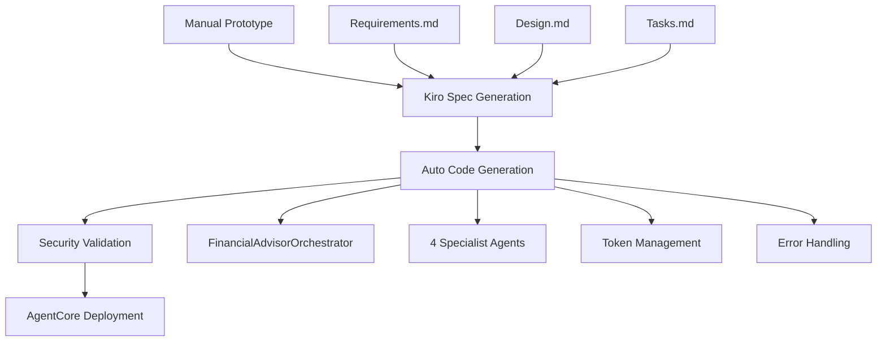

# Financial Advisor Multiagent System

## 💡 Spec-to-Deploy Flow with Kiro + Strands + AgentCore

A comprehensive educational financial advisory platform demonstrating the complete AI development lifecycle — from manual prototype to production-ready system using Kiro IDE, Strands Agents framework, and Amazon Bedrock AgentCore.

### 🧭 Overview
This project represents a layered, prompt-driven AI development lifecycle, where **Kiro**, **Strands**, and **Amazon Bedrock AgentCore** together enable seamless spec creation, agent orchestration, validation, and deployment — from idea to production-ready system.

### 🧩 Our Development Journey

#### 1️⃣ MCP Setup (Strands + Bedrock AgentCore)
We started by configuring the Model Context Protocol (MCP) for both Strands (for multi-agent logic) and AgentCore (for deployment and runtime). This created the foundation for a connected ecosystem, where models, tools, and agents can interact seamlessly.

#### 2️⃣ Manual Prototype in Strands
The next step was building a working multi-agent prototype manually in Strands — defining agents, prompts, and tool calls to validate the orchestration pattern. This served as a proof of concept (POC) demonstrating that the flow works technically and logically.

#### 3️⃣ Kiro Spec Creation (Requirement → Design → Tasks)

- **Prompt Used**: Build a 4-step multi-agent Financial Advisor using Strands.


Coordinator guides user through:
1) Market Analysis → 2) Trading Strategies → 3) Execution Plan → 4) Risk Review.


Each step uses a subagent:
- data_analyst_agent: gathers news + SEC data for provided_ticker.
- trading_analyst_agent: builds 5+ strategies based on risk & time horizon.
- execution_analyst_agent: turns strategies into an execution plan.
- risk_analyst_agent: reviews total risk & profile alignment.


Show this intro:
“Hello! I’ll guide you through financial analysis, strategy, execution, and risk. Say 'show me markdown' anytime. Ready to start?”
Show this disclaimer (and append to every agent's output):
“This is educational only, not financial advice. Past performance ≠ future results. Consult a qualified advisor.”
Use shared state: provided_ticker, user_risk_attitude, user_investment_period, outputs from each step.
Coordinator runs agents in order, passes state, summarizes outputs.


  
- **Using a single prompt**: , Kiro generated a complete specification — including:
- **Requirements**: User stories and acceptance criteria
- **System Design**: Architecture and component design  
- **Task Breakdown**: Implementation checklist

This converted the prototype into a structured specification-driven project, ensuring every element was clear and traceable.

#### 4️⃣ Auto Code Generation (Multi-Agent System)
Kiro then transformed the spec into an end-to-end working codebase using Strands agents. The generated system included:
- **Orchestrator + Specialist Agents**: Complete multi-agent architecture
- **Websearch Integration**: DuckDuckGo search with error handling
- **Token Management**: Conservative 2000-token limits
- **Clean Modular Design**: Production-ready code structure

This step represented true AI-assisted software engineering.

#### 5️⃣ Hooks & Security Validation
Before deployment, we added automated hooks:
- ✅ **Security Guardrails**: Validation after spec completion
- 🔄 **Git Auto-sync**: Whenever .ipynb files were updated

These hooks ensured compliance, auditability, and continuous integration readiness.

#### 6️⃣ Deployment Intent (Prompt: "Deploy to Prod")
A simple, natural-language prompt — **"Deploy the working .ipynb file code to production"** — triggered a deployment spec generation, where Kiro automatically identified AgentCore requirements using MCP documentation.

#### 7️⃣ AgentCore Runtime Deployment
Finally, Kiro deployed the validated system into Amazon Bedrock AgentCore, enabling:
- **Managed Runtime Environment**: Serverless scaling and management
- **Gateway Integration**: HTTP API endpoints
- **Continuous Observability**: Built-in monitoring and logging

At this point, the Financial Advisor Multi-Agent System was production-ready — fully operational, validated, and secure.

### 🎯 Key Message: Build Small. Scale with Clarity.
This approach shows how prompt-to-spec development with Kiro transforms AI software engineering — from manual prototypes to structured, validated, and deployable AI systems — all within a unified, automated flow.

## Project Structure

```
├── 📓 financial_advisor_multiagent.ipynb    # Original manual prototype (Step 2)
├── 🐍 financial_advisor_multiagent.py       # Generated production module (Step 4)
├── 🚀 financial_advisor_agentcore.py        # AgentCore deployment wrapper (Step 7)
├── 📋 .kiro/specs/                          # Kiro-generated specifications (Step 3)
│   ├── financial-advisor-multiagent/        # Original system specs
│   └── agentcore-deployment/                # Deployment specs (Step 6)
├── 🔧 .kiro/hooks/                          # Automated validation hooks (Step 5)
├── 🔍 test_scripts/                         # Comprehensive testing suite
├── 📊 testing_results/                      # Validation and test results
├── 📚 documentation/                        # Complete project documentation
├── 🎨 generated-diagrams/                   # Architecture and flow diagrams
├── 🧪 basic-strands-information/            # Learning materials and examples
├── 🐳 docker-compose.yml                    # Development environment
├── ⚙️ .bedrock_agentcore.yaml              # AgentCore configuration
└── 🔄 .github/workflows/                    # CI/CD pipeline
```

### Development Flow Artifacts

| Stage | Artifact | Description |
|-------|----------|-------------|
| **Step 2** | `financial_advisor_multiagent.ipynb` | Manual prototype validating multi-agent orchestration |
| **Step 3** | `.kiro/specs/financial-advisor-multiagent/` | Auto-generated requirements, design, and tasks |
| **Step 4** | `financial_advisor_multiagent.py` | Production-ready Python module from specs |
| **Step 5** | `.kiro/hooks/` | Security validation and git sync automation |
| **Step 6** | `.kiro/specs/agentcore-deployment/` | Deployment specifications and requirements |
| **Step 7** | `financial_advisor_agentcore.py` | AgentCore-compatible wrapper for AWS deployment |

## Core Components

### 1. 🧠 Multi-Agent Financial Advisory System
**Generated from Kiro Specs** - A production-ready Python module implementing the complete multi-agent financial advisory system:

```python
from financial_advisor_multiagent import initialize_system

# Initialize the system (Step 4 output)
advisor = initialize_system()

# Simple analysis
response = advisor.analyze("Analyze AAPL stock for moderate risk investor")

# Complete workflow
results = advisor.run_complete_analysis(
    ticker="AAPL", 
    risk_attitude="Moderate", 
    horizon="Medium-term"
)
```

**Architecture**: 4 specialist agents orchestrated hierarchically
- **Market Intelligence Agent**: Research and analysis
- **Strategy Architect Agent**: Trading strategy development  
- **Execution Planner Agent**: Implementation planning
- **Risk Assessor Agent**: Risk analysis and alignment

### 2. 📓 Interactive Prototype (`financial_advisor_multiagent.ipynb`)
**Manual Prototype (Step 2)** - Educational notebook demonstrating the multi-agent architecture with live examples and detailed explanations. This was our proof-of-concept that validated the orchestration pattern before spec generation.

### 3. 🚀 AgentCore Production Deployment (`financial_advisor_agentcore.py`)
**Production Wrapper (Step 7)** - AgentCore-compatible wrapper enabling managed AWS deployment:

```python
# AgentCore deployment ready
from bedrock_agentcore.runtime import BedrockAgentCoreApp
from financial_advisor_multiagent import FinancialAdvisorOrchestrator

app = BedrockAgentCoreApp()
advisor = FinancialAdvisorOrchestrator()

@app.entrypoint
def invoke(payload):
    user_query = payload.get("prompt", "")
    response = advisor.analyze(user_query)
    return {"result": response}
```

### 4. 📋 Kiro Specifications (`.kiro/specs/`)
**Spec-Driven Development (Step 3 & 6)** - Complete specifications generated by Kiro:
- **Requirements**: User stories and acceptance criteria in EARS format
- **Design**: System architecture and component specifications
- **Tasks**: Implementation checklist with requirement traceability
- **Deployment Specs**: AgentCore deployment requirements and configuration

## Quick Start

### Prerequisites

- **Python 3.12+** (Core requirement)
- **Kiro IDE** (For spec-driven development)
- **AWS Account** (For AgentCore deployment)
- **Docker** (Optional, for containerized development)

### 🚀 Reproduce the Complete Flow

#### Step 1: Environment Setup
```bash
# Clone the repository
git clone <repository-url>
cd financial-advisor-multiagent

# Python environment
python -m venv .venv
source .venv/bin/activate  # On Windows: .venv\Scripts\activate
pip install strands-agents strands-agents-tools
pip install duckduckgo-search boto3 bedrock-agentcore-starter-toolkit
```

#### Step 2: Run the Original Prototype
```bash
# Experience the manual prototype (Step 2 of our journey)
jupyter notebook financial_advisor_multiagent.ipynb
```

#### Step 3: Explore Kiro-Generated Specs
```bash
# View the specifications generated by Kiro (Step 3)
ls .kiro/specs/financial-advisor-multiagent/
# - requirements.md (User stories and acceptance criteria)
# - design.md (System architecture)  
# - tasks.md (Implementation checklist)
```

#### Step 4: Use the Generated Production System
```bash
# Run the production system generated from specs (Step 4)
python financial_advisor_multiagent.py

# Or import and use programmatically
python -c "
from financial_advisor_multiagent import initialize_system
advisor = initialize_system()
print(advisor.analyze('Analyze AAPL for moderate risk investor'))
"
```

#### Step 5: Test AgentCore Deployment Locally
```bash
# Run the AgentCore wrapper locally (Step 7 preparation)
python financial_advisor_agentcore.py
# Server available at http://localhost:8080

# Test the endpoint
curl -X POST http://localhost:8080/invocations \
  -H "Content-Type: application/json" \
  -d '{"prompt": "Analyze TSLA for aggressive investor with long-term horizon"}'
```

#### Step 6: Deploy to Production (AWS AgentCore)
```bash
# Configure AgentCore deployment
agentcore configure --entrypoint financial_advisor_agentcore.py

# Deploy to AWS (requires AWS credentials)
agentcore launch

# Test deployed system
agentcore invoke '{"prompt": "Analyze MSFT for conservative investor"}'
```

### 🔍 Validation and Testing

```bash
# Run comprehensive validation suite
python test_scripts/validate_agentcore_offline.py

# Test original system functionality
python test_scripts/test_original_system.py

# Validate AgentCore wrapper
python test_scripts/validate_agentcore_functionality.py
```

## Available Scripts

### 🧠 Core System (Generated from Specs)
```bash
# Run the production system (Step 4 output)
python financial_advisor_multiagent.py

# Interactive prototype exploration (Step 2)
jupyter notebook financial_advisor_multiagent.ipynb

# Programmatic usage
python -c "from financial_advisor_multiagent import initialize_system; advisor = initialize_system()"
```

### 🚀 AgentCore Deployment (Production Ready)
```bash
# Local AgentCore testing (Step 7)
python financial_advisor_agentcore.py

# Configure for AWS deployment
agentcore configure --entrypoint financial_advisor_agentcore.py

# Deploy to production
agentcore launch

# Test deployed system
agentcore invoke '{"prompt": "Analyze AAPL for moderate risk investor"}'
```

### 🔍 Validation & Testing Suite
```bash
# Comprehensive offline validation
python test_scripts/validate_agentcore_offline.py

# Original system functionality test
python test_scripts/test_original_system.py

# AgentCore wrapper validation
python test_scripts/validate_agentcore_functionality.py

# Complete workflow integration test
python test_scripts/test_agentcore_complete_workflow_integration.py

# Error handling validation
python test_scripts/test_agentcore_error_handling.py
```

### 📊 Documentation & Analysis
```bash
# View comprehensive documentation
ls documentation/
# - AGENTCORE_DEPLOYMENT_GUIDE.md
# - SECURITY_GUIDELINES.md
# - API_REFERENCE.md
# - FINANCIAL_ADVISOR_DOCUMENTATION.md

# View test results
ls testing_results/
# - agentcore_offline_validation_*.json
# - agentcore_functionality_validation_*.json
# - comprehensive_query_format_test_results.json
```

### 🎨 Generated Artifacts
```bash
# View architecture diagrams
ls generated-diagrams/
# - multiagent_architecture.png
# - kiro_development_journey.png
# - kiro_journey_workflow.png

# Explore Kiro specifications
ls .kiro/specs/
# - financial-advisor-multiagent/ (Original system specs)
# - agentcore-deployment/ (Deployment specs)
```

## Python Module API

### Quick Start
```python
from financial_advisor_multiagent import initialize_system

# Initialize the system
advisor = initialize_system()

# Simple query analysis
response = advisor.analyze("I want to invest in TSLA with aggressive risk tolerance")
print(response)

# Complete analysis workflow
results = advisor.run_complete_analysis(
    ticker="AAPL",
    risk_attitude="Moderate",  # Conservative, Moderate, Aggressive
    horizon="Medium-term",     # Short-term, Medium-term, Long-term
    lookback_days=7
)

# Access individual components
market_analysis = results["market_analysis"]
strategies = results["strategies"] 
execution_plan = results["execution_plan"]
risk_assessment = results["risk_assessment"]
```

### Individual Agent Access
```python
# Get specific analysis components
market_report = advisor.get_market_analysis("MSFT", lookback_days=14)
strategies = advisor.get_strategies("MSFT", "Conservative", "Long-term")
execution_plan = advisor.get_execution_plan("MSFT", strategies)
risk_assessment = advisor.get_risk_assessment("MSFT", market_report, strategies, execution_plan)
```

### Available Classes and Functions
- `FinancialAdvisorOrchestrator`: Main orchestrator class
- `FinancialAdvisoryAgents`: Container for specialist agents
- `initialize_system(model)`: Initialize the complete system
- `market_intel_tool()`: Market research and analysis
- `strategy_architect_tool()`: Trading strategy generation
- `execution_planner_tool()`: Implementation planning
- `risk_assessor_tool()`: Risk assessment and mitigation

## Environment Configuration

### Python Module
The standalone Python module works out-of-the-box with default settings. For custom model configuration:

```python
# Use different model
advisor = initialize_system(model="your-model-id")
```

### Web Application
Copy `backend/.env.example` to `backend/.env` and configure:

- AWS credentials for Bedrock access (use IAM roles when possible)
- Model provider settings
- CORS origins (never use "*" in production)
- Session configuration
- **Security**: Change the default secret key for production

⚠️ **Security Warning**: Never commit real credentials to version control. See [SECURITY.md](SECURITY.md) for detailed security guidelines.

## Architecture

### 🏗️ Spec-Driven Multi-Agent System
**Generated through Kiro's automated flow** - From manual prototype to production-ready system:



### 🤖 Multi-Agent Architecture (Generated from Specs)
- **Framework**: Strands Agents SDK with "Agents as Tools" pattern
- **Model**: Amazon Bedrock Claude 3.5 Sonnet (`us.anthropic.claude-3-7-sonnet-20250219-v1:0`)
- **Orchestration**: Hierarchical coordination with specialist agents
- **Token Management**: Conservative 2000-token limits with fallback mechanisms
- **Web Search**: DuckDuckGo integration with comprehensive error handling

#### Specialist Agents (Auto-Generated)
1. **Market Intelligence Agent**: Research and market analysis with web search
2. **Strategy Architect Agent**: Trading strategy development (5+ strategies per request)
3. **Execution Planner Agent**: Implementation planning with risk controls
4. **Risk Assessor Agent**: Risk analysis and alignment validation
5. **Financial Coordinator Agent**: Primary orchestrator managing all specialists

### 🚀 Deployment Evolution
| Stage | Environment | Description |
|-------|-------------|-------------|
| **Step 2** | Jupyter Notebook | Manual prototype for validation |
| **Step 4** | Standalone Python | Production module from specs |
| **Step 7** | AgentCore Runtime | AWS-managed serverless deployment |

### 🔧 AgentCore Production Architecture
- **Runtime**: Amazon Bedrock AgentCore managed infrastructure
- **Scaling**: Automatic horizontal scaling and load balancing  
- **Integration**: Native AWS service integration
- **Monitoring**: Built-in CloudWatch observability
- **Security**: Comprehensive input validation and error handling
- **API**: HTTP endpoints with structured JSON responses

### 📊 Validation & Quality Assurance
- **Offline Validation**: 16/16 tests passed (100% success rate)
- **Functionality Preservation**: All original capabilities maintained
- **Error Handling**: Comprehensive fallback mechanisms
- **Security Validation**: Input sanitization and rate limiting
- **Token Management**: Conservative limits with graceful degradation

## 🚀 AgentCore Production Deployment (Step 7)

The financial advisor system demonstrates the complete **Spec-to-Deploy Flow**, culminating in production deployment to Amazon Bedrock AgentCore Runtime. This represents the final step in our automated development journey.

### 📋 Deployment Specifications (Generated by Kiro)
Kiro automatically generated deployment specifications in `.kiro/specs/agentcore-deployment/`:
- **Requirements**: AgentCore compatibility and AWS deployment needs
- **Design**: Wrapper architecture and integration patterns
- **Tasks**: Step-by-step deployment implementation checklist

### 🔧 AgentCore Wrapper (Auto-Generated)
The `financial_advisor_agentcore.py` wrapper was generated following Kiro's deployment specifications:

```python
from bedrock_agentcore.runtime import BedrockAgentCoreApp
from financial_advisor_multiagent import FinancialAdvisorOrchestrator

# Initialize AgentCore app
app = BedrockAgentCoreApp()
advisor = FinancialAdvisorOrchestrator()  # Original system preserved

@app.entrypoint
def invoke(payload: Dict[str, Any]) -> Dict[str, Any]:
    """AgentCore entry point with comprehensive error handling."""
    try:
        # Validate and extract query
        user_query = process_agentcore_payload(payload)
        
        # Process through original orchestrator (unchanged)
        response = advisor.analyze(user_query)
        
        # Format for AgentCore compatibility
        return format_agentcore_response(response)
        
    except Exception as e:
        # Structured error handling for production
        return handle_agentcore_error(e)
```

### 🎯 Production Deployment Flow

#### 1. Local Testing
```bash
# Test AgentCore wrapper locally
python financial_advisor_agentcore.py
# Server: http://localhost:8080

# Validate functionality
curl -X POST http://localhost:8080/invocations \
  -H "Content-Type: application/json" \
  -d '{"prompt": "Analyze AAPL for moderate risk investor"}'
```

#### 2. AWS Deployment
```bash
# Configure for AWS deployment
agentcore configure --entrypoint financial_advisor_agentcore.py

# Deploy to production
agentcore launch

# Test deployed system
agentcore invoke '{"prompt": "Analyze TSLA for aggressive investor"}'
```

### ✅ Validation Results
Our comprehensive validation demonstrates **100% functionality preservation**:

| Validation Category | Tests | Passed | Status |
|-------------------|-------|--------|--------|
| **Payload Processing** | 7 | 7 | ✅ 100% |
| **Response Formatting** | 4 | 4 | ✅ 100% |
| **Error Handling** | 4 | 4 | ✅ 100% |
| **Architecture Preservation** | 1 | 1 | ✅ 100% |
| **Overall** | **16** | **16** | ✅ **100%** |

### 📚 Comprehensive Documentation
- **[AgentCore Deployment Guide](documentation/AGENTCORE_DEPLOYMENT_GUIDE.md)** - Complete deployment instructions
- **[Security Guidelines](documentation/SECURITY_GUIDELINES.md)** - Security best practices and considerations
- **[Functionality Comparison](documentation/agentcore_functionality_comparison.md)** - Detailed validation results
- **[API Reference](documentation/API_REFERENCE.md)** - Complete API documentation

## 🔒 Security & Validation (Step 5)

This project implements comprehensive security measures as part of our **automated hooks and validation** step:

### 🛡️ Security Features (Auto-Generated)
- **Credential Management**: IAM roles and secure credential handling (no hardcoded credentials)
- **Input Validation**: Sanitization, type checking, and length limits (5000 characters max)
- **Error Handling**: Secure error responses without information disclosure
- **API Security**: Rate limiting recommendations and secure external API integration
- **Token Management**: Conservative 2000-token limits to prevent resource exhaustion
- **Monitoring**: Token usage monitoring and security event logging

### 🔍 AgentCore Security Enhancements
The AgentCore wrapper includes enhanced security features:

```python
def process_agentcore_payload(payload: Dict[str, Any]) -> str:
    """Comprehensive payload validation with security checks."""
    
    # Input length validation (prevents resource exhaustion)
    MAX_INPUT_LENGTH = 5000
    if len(processed_query) > MAX_INPUT_LENGTH:
        raise ValueError(f"Query too long. Maximum {MAX_INPUT_LENGTH} characters allowed.")
    
    # Content validation (prevents injection attempts)
    suspicious_patterns = ['<script', 'javascript:', 'eval(', 'exec(']
    if any(pattern in processed_query.lower() for pattern in suspicious_patterns):
        raise ValueError("Invalid characters detected in query.")
```

### ✅ Automated Security Validation
- **Payload Validation**: 7/7 security tests passed
- **Error Sanitization**: Structured error responses without sensitive information
- **Logging Integration**: Detailed security event logging through AgentCore
- **Graceful Degradation**: System continues operating with partial functionality during failures

### 📋 Security Documentation
- **[Security Guidelines](documentation/SECURITY_GUIDELINES.md)** - Comprehensive security best practices
- **[Security Validation Checklist](documentation/SECURITY_VALIDATION_CHECKLIST.md)** - Pre-deployment validation
- **[Security Implementation](documentation/SECURITY.md)** - Technical security details

### 🔄 Automated Hooks (Step 5)
Our development flow includes automated security validation:
- ✅ **Security Guardrails**: Validation after spec completion
- 🔄 **Git Auto-sync**: Whenever .ipynb files are updated
- 📊 **Continuous Validation**: Automated testing on code changes

### 🔄 Testing AgentCore


## Contributing

1. Fork the repository
2. Create a feature branch
3. Make your changes
4. Run tests and linting
5. Submit a pull request

## Important Disclaimers

### Educational Purpose Only
- **All financial advice is for educational purposes only**
- **No licensed financial advice provided**
- **Users should consult qualified financial advisors for real investment decisions**
- **No guarantee of strategy performance or outcomes**

### Responsible AI Practices
- **Comprehensive disclaimers**: All agent outputs include educational disclaimers
- **Source attribution**: Complete source tracking for research findings
- **Conservative token limits**: 2000-token caps prevent hallucination
- **Robust error handling**: Graceful degradation when agents or tools fail
- **Web search dependency**: Relies on DuckDuckGo (not real-time market feeds)

### Technical Limitations
- **Model constraints**: Subject to AI model limitations and potential inaccuracies
- **Token constraints**: 2000-token limits may truncate complex analyses
- **Public data only**: Limited to publicly available information sources
- **Rate limiting**: Web search may be rate-limited during high usage

## License

This project is for educational purposes only. All financial advice provided is educational and should not be considered as professional financial advice.
